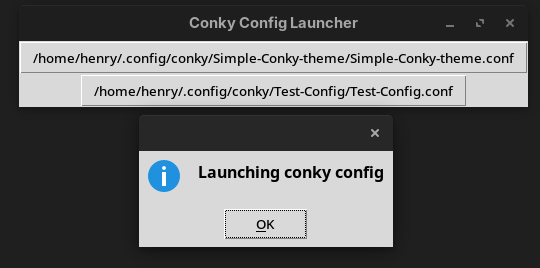

# Conky Config Launcher

A simple project made using TCL 9.0.0 to launch different conky desktop configs.



### Requirements

* Conky must be installed
* Conky configs must be in ~/.config/conky - all subdirs will be searched

### Usage

To launch the gui
```bash
tclsh main.tcl
```